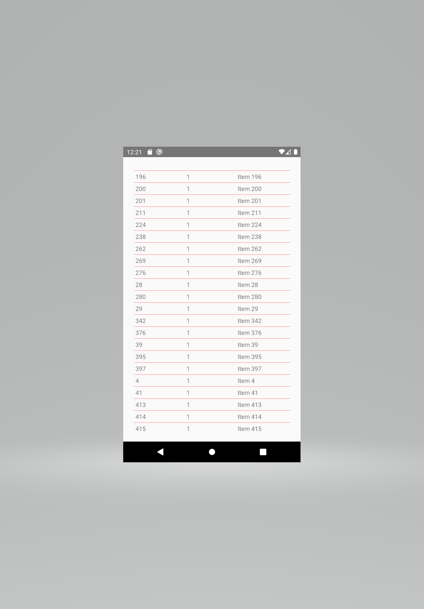
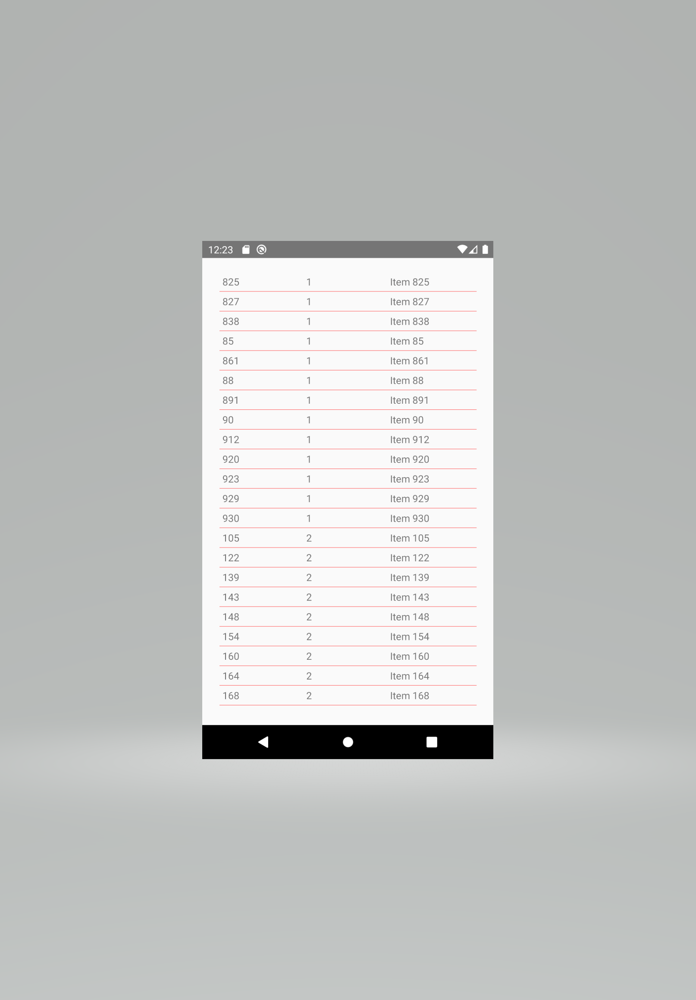
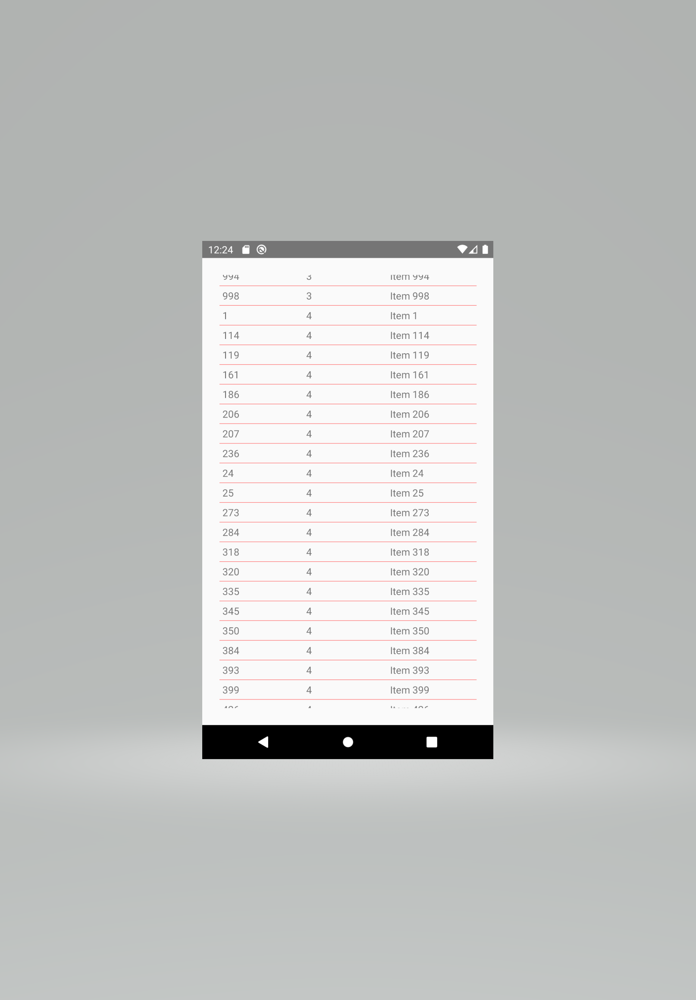

# Fetch Rewards Android TakeHome 
### Built with **React Native**

### Please write a native Android app in Kotlin or Java that retrieves the data from **https://fetch-hiring.s3.amazonaws.com/hiring.json**

> Display this list of items to the user based on the following **requirements:**

>> Display all the items grouped by **"listId"**
>> Sort the results first by "listId" then by "name" when **displaying.**
>> Filter out any items where "name" is blank or **null.**
>> The final result should be displayed to the user in an easy-to-read **list.**

  
 
 
 